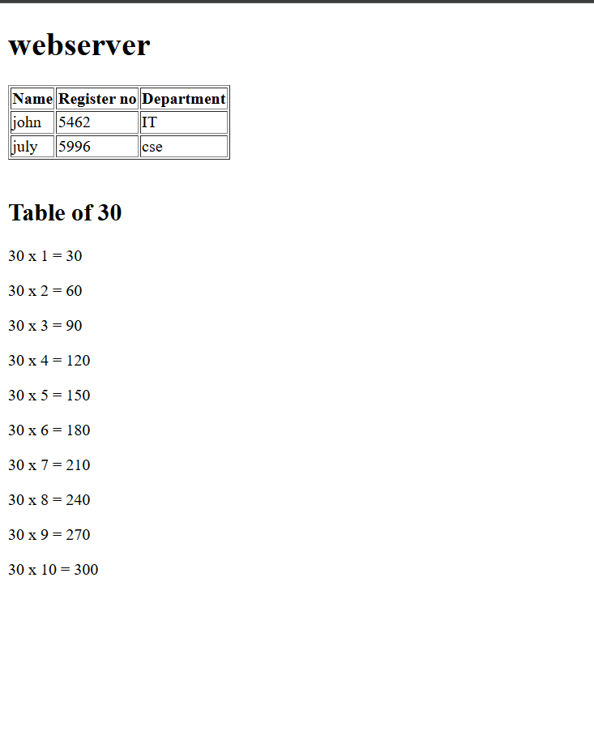

 
# EX01 Developing a Simple Webserver
## Date:

## AIM:
To develop a simple webserver to serve html pages and display the configuration details of laptop.

## DESIGN STEPS:
### Step 1: 
HTML content creation.

### Step 2:
Design of webserver workflow.

### Step 3:
Implementation using Python code.

### Step 4:
Serving the HTML pages.

### Step 5:
Testing the webserver.

## PROGRAM:
```html
<!DOCTYPE html>
<html lang="en">
<head>
    <meta charset="UTF-8">
    <meta name="viewport" content="width=device-width, initial-scale=1.0">
    <title>30th table</title>
</head>
<body>
    <h1>webserver</h1>
    <table border="1">
        <tr>
            <th>Name</th>
            <th>Register no</th>
            <th>Department</th>
        </tr>
        <tr>
            <td>john</td>
            <td>5462</td>
            <td>IT</td>
        </tr>
        <tr>
            <td>july</td>
            <td>5996</td>
            <td>cse</td>
        </tr>
        </table>
        <br>
    <h2>Table of 30</h2>
    <p>30 x 1 = 30</p>
    <p>30 x 2 = 60</p>
    <p>30 x 3 = 90</p>
    <p>30 x 4 = 120</p>
    <p>30 x 5 = 150</p>
    <p>30 x 6 = 180</p>
    <p>30 x 7 = 210</p>
    <p>30 x 8 = 240</p>
    <p>30 x 9 = 270</p>
    <p>30 x 10 = 300</p>
</body>
</html>
```

## OUTPUT:



## RESULT:
The program for implementing simple webserver is executed successfully.
